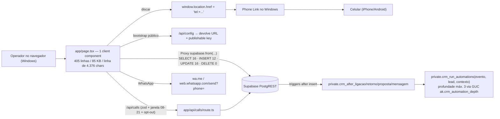

# `adrielmatos/ak-call-center` — como o projeto trabalha (leitura do repositório)

**Análise feita em 27/09/2026** a partir do conteúdo real do repo (README, `package.json`, `vercel.json`,
`next.config.js`, `middleware.ts`, `app/page.tsx`, `app/api/calls/route.ts`, `lib/supabase/*`,
`lib/importer.ts`, `lib/validations.ts`, os 3 arquivos SQL de `supabase/migrations/`, os 3 workflows do
GitHub Actions, `.env.example`, `.gitignore`, `SECURITY.md`, `CODEOWNERS`) + API do GitHub
(commits, branches, issues, languages, contributors).
Nada aqui é inferido do README — quando o README diz uma coisa e o código diz outra, eu marco.

---

## 1. Ficha do projeto

| Campo | Valor (via API do GitHub) |
|---|---|
| Dono / nome | `adrielmatos/ak-call-center` |
| Descrição | *"A&K Next.js Vercel-ready Supabase Postgres call center chat GPT"* |
| Criado / último push | 20/09/2026 → 26/09/2026 (7 dias) |
| Estrelas / forks / watchers | 0 / 0 / 0 |
| **Licença** | **nenhuma** (API devolve `spdx_id: null`) |
| Contribuidores | 1 (`adrielmatos`, 120 commits) |
| Branches | 9 (`main` + 8 `feat/*` e `fix/*`) |
| Issues | 10 abertas/fechadas — todas **abertas e fechadas pelo próprio autor**, corpo em PT-BR, título no formato `feat:`/`fix:` |
| Linguagens | TypeScript 161 KB · PLpgSQL 14,6 KB · CSS 5 KB · JavaScript 0,5 KB |
| Deploy declarado | `https://ak-call-center-z0ui.vercel.app` (Vercel) + Supabase (`*.supabase.co`) |
| Testes | **não existem** — `package.json` só tem `dev`, `build`, `start` (sem `test`, sem `lint`) |

É o repositório de **uma pessoa, em uso real, operando um call center de crédito consignado da marca
"A&K Soluções Financeiras"** — não é um projeto comunitário. Isso muda o que você deve tirar dele
(veja §8 e §9).

---

## 2. O que o repositório realmente é

- **Base:** fork/clean-up do starter **`supabase-community/nextjs-with-supabase`** (MIT).
  `package.json` mantém `"repository": "github.com/supabase-community/nextjs-with-supabase"`,
  `vercel.json` mantém `"repository": 0` (campo do template), e os arquivos de template que o app não
  usa continuam lá: `app/shared/{counting-buttons,skeleton-card,feedback-form,submit-button}.tsx`,
  `app/welcome/{env-checklist,setup-notes,fallback-keys}.tsx`. **Estrela/Vercel/Supabase continuam funcionando.**
- **Sobre isso** foram escritos ~120 commits em 7 dias com o produto de discagem + CRM.
- O README é honesto no essencial: *"camada de segurança operacional e endurecimento de banco sem
  alterar a lógica de discagem do Phone Link. Não há substituição de WebRTC nem automação de sistema
  operacional."* — e o código confirma exatamente isso.

---

## 3. Arquitetura real (o que o código faz)



Decisões estruturais que dá para ver no código:

1. **Praticamente não existe back-end.** 3 rotas de API para um app inteiro:
   `/api/health` (probe), `/api/config` (bootstrap público) e `/api/calls` (a única com regra de negócio).
   Todo o resto é o **navegador batendo direto no PostgREST** com a publishable key, protegido só por RLS.
2. **`lib/supabase/client.ts` é um `Proxy` preguiçoso** — `supabase.from(...)` funciona sem
   `NEXT_PUBLIC_*` embutido no build, porque ele cai no `/api/config` em runtime. O comentário no arquivo
   explica o motivo: *"para deployments na Vercel onde a configuração pública mudou depois de um build ou
   não foi embutida no bundle"*. É uma solução esperta para o problema real de "rebuild a cada mudança de env"
   (3 commits só para fechar corrida de inicialização: *"fix: make Supabase browser bootstrap deterministic
   and auth-listener safe"*, *"fix: prevent Supabase auth runtime crash before client initialization"*).
   Custo: no servidor, `createClient()` devolve um cliente apontando para `https://placeholder.invalid`
   — se alguém usar `@/lib/supabase` num Server Component, a chamada vai falhar tarde e torto.
3. **A fila mora na memória do navegador**, não no banco:
   ```js
   const available = useMemo(() => leads.filter(l => l.status === "disponivel"
     && !l.bloqueado && !l.opt_out && l.telefones?.length), [leads]);
   const current = available[0];
   ```
   Não há RPC de *claim*, não há `FOR UPDATE SKIP LOCKED`, não há índice único de "job aberto", não há
   realtime (`onAuthStateChange` é o único `.on(` do arquivo). Dois operadores abertos no mesmo instante
   recebem exatamente o mesmo `current`. O commit *"carregamento preguiçoso por módulo, evitando baixar
   5.000 ligações e todas as tabelas a cada navegação"* (issue #4) mostra que eles já sentiram o problema
   — a resposta foi `limit(500)`/`limit(1000)` no cliente, não particionar a fila no servidor.
4. **CRM foi injetado por fora, via triggers.** A migration 2 cria 13 tabelas `crm_*` e escreve *"Existing
   dialer lead and telephony rules remain authoritative; CRM tables integrate through stable lead and call
   keys."*. A migration 3 liga isso ao fluxo com `after insert` em `ligacoes`, `retornos`, `crm_propostas`,
   `crm_mensagens` → gera `crm_atividades` (timeline Customer 360) e dispara `crm_run_automations`.
5 **Segurança em camadas, com gate de CI dedicado** (detalhes no §6).

---

## 4. Como a "discadora" trabalha (e o que ela não é)

O que existe:

| Mecanismo | Evidência |
|---|---|
| Clicar para discar | `window.location.href = "tel:+" + current.telefones[0].numero_normalizado` e `<a href="tel:+…">☎ Ligar</a>` (7 ocorrências de `tel:+` em `app/page.tsx`) |
| Integração com o telefone | Só pelo **Phone Link do Windows** interpretando o `tel:` (README: *"ligações usam o protocolo tel: integrado ao telefone vinculado ao Windows"*) |
| WhatsApp sem API oficial | `wa.me/…` e `web.whatsapp.com/send?phone=…`, número do operador guardado em `configuracoes_canais.whatsapp_numero`; issue #1: *"adapta o canal WhatsApp para uso no PC sem Meta API"* |
| Registro da chamada | `POST /api/calls` com `resultado` escolhido pelo operador (check constraint `allowed_call_resultados` com 12 valores), duração medida por um timer no navegador (commit *"fix: make dialer script timer browser-safe"*) |
| Script de abordagem por produto | `app/components/dialer-script.tsx`: roteiros "humanizados" editáveis para **SIAPE, INSS, BPC/LOAS**, cacheado em `localStorage` com a chave `ak-call-center:scripts:v1` |
| Bloqueio de discar proibido | `leads.bloqueado`/`opt_out` verificados no servidor (409 `lead_blocked`) + tabela `lista_nao_perturbe` (CPF/telefone/origem/motivo/ativo/data_bloqueio) |
| Horário legal | `brasilHour(inicio)` via `Intl` com `America/Sao_Paulo`; **422 `calling_window_closed` se 8h > hora > 21h** |

O que **não** existe (procurei por palavra inteira em `app/` e `lib/`, tudo zero):
`Asterisk` · `ARI` · `FreeSWITCH` · `Twilio` · `getUserMedia` · `MediaRecorder` · `SpeechRecognition` ·
`openai` / `gpt-` / `whisper` / `anthropic` / `llm`.

Consequências diretas:

- **Não é discadora preditiva/automática.** É *click-to-call*: o sistema prepara o lead, o humano clica, o
  Windows disca. Não há progressividade, nem detecção de atendimento, nem discagem em lote, nem gravação,
  nem transcrição.
- **O "chat GPT" da descrição não existe no repositório.** A parte "inteligente" é um arquivo de roteiros
  em texto. Se você viu "chat GPT" e achou que havia IA, não há.
- **Não sabe quando a chamada terminou.** Duração e resultado são o que o operador digita. CDR real é
  impossível por iPhone — e eles não tentaram.

---

## 5. Banco de dados: o achado mais importante

As 3 migrations são boas — mas **elas não descrevem o banco do projeto**. Contagem objetiva:

- **13 tabelas usadas pelo código nunca são criadas em lugar nenhum do repo**:
  `leads`, `operadores`, `ligacoes`, `retornos`, `telefones`, `campanhas`, `auditoria`, `importacoes`,
  `lista_nao_perturbe`, `configuracoes_discador`, `configuracoes_canais`, `crm_atividades`, `crm_etapas`.
- **As políticas de RLS chamam funções que não existem no repo**:
  `private.current_operator_active()` — **0 definições, 14 referências**;
  `private.current_operator_is_admin()` — **0 definições, 6 referências**;
  `private.current_operator_id()` — **0 definições, 1 referência**.
  Só `private.current_operator_is_owner()` está definida (na migration 1).
- Ou seja: **o schema base e as funções de identidade vivem no editor SQL do projeto Supabase, fora do
  Git**. Num projeto novo, `supabase db push` **falha** ("function private.current_operator_active does not
  exist" já na primeira política de `importacoes`), e não há como saber se `leads`/`telefones`/`operadores`
  têm RLS habilitado — exatamente as tabelas com CPF, nome e telefone.
- A tabela `auditoria` lida pela UI **não é** a `audit_logs` criada/hardenizada pela migration 1.
  Fluxo real: `/api/calls` insere em `audit_logs` + `consent_logs`; a aba "Auditoria operacional" lê
  `auditoria`, que é escrita pelo navegador (`supabase.from("auditoria").insert({...})`). **São dois trilhos
  de auditoria paralelos: o trilha endurecida nunca aparece na tela, e a que aparece não passa pela API.**
- A migration 1, essa sim, é cuidadosa: `audit_logs`/`consent_logs` com `request_id`, `ip INET`,
  `user_agent`, `metadata jsonb`; índices por ator/recurso/hora; `GRANT insert, select` para
  `authenticated` e **`revoke update, delete, truncate`** (imutabilidade de trilha de auditoria);
  `select` das tabelas de trilha só para owner via `private.current_operator_is_owner()`.

---

## 6. O que eles fazem bem (e vale copiar a ideia)

| Prática | Onde |
|---|---|
| **Janela de discagem 08:00–21:00 (América/São Paulo) validada no servidor**, com `Intl.DateTimeFormat` + `formatToParts` | `app/api/calls/route.ts` |
| **Opt-out/bloqueio verificados no servidor**, HTTP 409, antes de inserir a ligação | idem |
| Operador precisa ser `ativo` e estar vinculado ao `auth_user_id` | idem |
| `x-request-id` (`crypto.randomUUID()`) propagado do handler para `consent_logs` e `audit_logs` | idem |
| **`zod` com `.strict()`** em toda entrada, `max(2000)` em observação, `max(80)` em resultado, enum de `resultado` **espelhado entre `lib/validations.ts` e o check constraint do banco** (o comentário avisa: *"The database constraints below are the enforcement layer; Zod is a user-facing guardrail"*) | `lib/validations.ts` + migration 1 |
| `import_leads_batch(...)` como **RPC** para insert em lote, com `ON CONFLICT DO NOTHING` e `RETURNING` — importação não é `insert` gigante do navegador | migration 1 + `lib/importer.ts` |
| **Importador que não descarta coluna**: `extras` guarda TODAS as colunas da planilha (`serializeExtraValue` serializa `Date`→ISO e objeto→JSON) + dicionário de apelidos (`aliases`) para `banco`, `produto`, CPF, telefone | `lib/importer.ts` |
| Trigger de CRM com **anti-recursão** por GUC (`ak.crm_automation_depth`, máx. 3) e `exception when others` que grava a falha em `crm_automacao_execucoes` em vez de derrubar o insert | migration 3 |
| `revoke all on function ... from public, anon, authenticated` nas funções de trigger/automação | migration 3 |
| `middleware.ts`: rotas `/api/*` autenticadas com **resposta JSON 401** (não redirect de HTML) + exceção explícita e comentada para `/api/config` e `/api/health`; cabeçalho `x-request-id` criado na borda | `middleware.ts` |
| CSP + HSTS/preload/`X-Frame-Options`/`Referrer-Policy`/`Permissions-Policy` **em dois lugares** (`vercel.json` e `next.config.js`) para valer na Vercel e fora dela | arquivos de config |
| **Workflow "Supabase Guard"**: falha o CI se qualquer `create table` numa migration não tiver o `alter table ... enable row level security` correspondente | `.github/workflows/supabase-guard.yml` |
| `SECURITY.md` com controles obrigatórios ("RLS on every public Supabase table", "service_role only server-side", prazos de resposta 24h/72h) e `CODEOWNERS` travando `/supabase/migrations/`, `/app/api/`, `/lib/supabase/`, `vercel.json`, workflows | raiz e `.github/` |
| Runbook operacional no README: variáveis, `PATH=$HOME/.npm-global/bin`, `supabase db push --include-all` por causa do prefixo de timestamp, SQL de diagnóstico para "login não cria operador", **rollback** (`db reset --back-up`), tabela "Problemas comuns" | README |

Nada disso é óbvio para um projeto de 7 dias. Fica claro que alguém (ou o agente dele) leu o alerta de
segurança do template ("This template does not include any security hardening...") e foi atrás.

---

## 7. Defeitos concretos que eu achei (verificáveis)

1. **O workflow `Security Scan` quebra no passo de install.** Ele roda `npm ci`, mas **não existe
   `package-lock.json` no repo** (`raw.githubusercontent.com/.../package-lock.json` → HTTP 404). Reproduzi
   aqui com o `package.json` exato deles: `npm ci` → `EUSAGE`, exit code **1**.
2. **...e quebraria de novo logo adiante.** Com esse `package.json`, `npm audit --audit-level=high`
   (o passo seguinte do mesmo workflow) devolve exit **1** com 3 vulnerabilidades, 2 *high*:
   `xlsx 0.18.5` — *Prototype Pollution* (GHSA-4r6h-8v6p-xvw6) e *ReDoS* (GHSA-5pgg-2g8v-p4x9),
   **"No fix available"** (o pacote `xlsx` no npm foi abandonado; a SheetJS se distribui por cdn.sheetjs.com)
   — e `postcss` via `next 15.x` (correção = subir para `next@16`, breaking).
   Isso importa porque **o importador deles faz `XLSX.read()` em arquivo enviado pelo usuário** —
   é a superfície exata desses CVEs.
3. **Fila sem reserva** (§3.3): dois operadores no mesmo lead; e como o estado é `leads.status = "disponivel"`
   atualizado pelo navegador, a discada "pendente" não tem dono. O `DELETE` nunca é usado (0 ocorrências),
   então não há limpeza de job abandonado — mas também não há reclaim.
4. **Duas trilhas de auditoria desconectadas** (§5). A migration criou `audit_logs`, o seletor continua lendo `auditoria`.
5. **`app/page.tsx` monolítico e denso**: 405 linhas físicas com 85 KB (linha mais longa 4.376 caracteres) e
   `useMemo`/`Promise.all` de 6+ consultas por aba. A componentização existe só em 4 arquivos
   (`operations-hub`, `operations-surface`, `dialer-script`, `bank-badge`) — e o `operations-hub.tsx` repete o
   mesmo `supabase.from("crm_*")` do `page.tsx`, com o mesmo comentário copiado
   (*"Mantém a discadora original intacta, lendo apenas as tabelas criadas pela integração CRM."*).
6. **Zero testes, zero lint, build não reproducible** (`npm install` no CI em vez de `npm ci`).
   O badge do README ("Build de produção validado pelo workflow CI antes de considerar a versão pronta") só
   vale para o job `build`; o `Security Scan` está fora do ar.
7. **Bug em aberto duplicado**: issue #7 "fix: display bank in mailing preview" (aberta) e #8
   "fix: make bank visible in mailing preview" (fechada) são o mesmo problema. O autor fechou uma e abriu outra
   — sinal de processo guiado por agente, não de triagem.
8. **`README.md` e `next.config.js` contêm um trecho órfão**: `at the bottom (replaces the template's Supabase checklist).`
   — resíduo de patch de texto. Menor, mas é a prova de que as mudanças foram feitas por substituição de
   bloco, com revisão frouxa.
9. **`.env.example` com o project ref real commitado**: `NEXT_PUBLIC_SUPABASE_URL=https://vtwyojpsrjyigsnnfawa.supabase.co`.
   Para chave *publishable* isso não é segredo por design, e o `/api/config` expõe a mesma informação a
   qualquer visitante do app em produção. Mas a consequência é: **o único muro entre o público e `leads`/
   `telefones` é o RLS de tabelas que não estão no repo** (§5). O `.gitleaks.toml` do repo é **vazio** (0 bytes).

---

## 8. Sobre consignado: o que ele cobre e o que não cobre

Cobre (e bem):

- `lista_nao_perturbe` como tabela própria, com `origem`/`motivo`/`data_bloqueio` e UI de 500 linhas ativas;
- opt-out aplicado **no servidor**, não escondido na UI;
- janela 08–21 e `consent_logs` com `granted`/`consent_type`/`source`/`request_id`;
- script por produto (SIAPE/INSS/BPC-LOAS) com linguagem de **consulta/simulação** —
  "A consulta é uma simulação e não garante aprovação", "posso te enviar a simulação pelo WhatsApp para
  você analisar com calma antes de tomar qualquer decisão", "eu verifico as opções e te explico **antes de
  qualquer contratação**". Isso é alinhado à Lei nº 15.327/2026 (proibida contratação por telefone/voz) e à
  IN 213/2026 (não vale autorização só por gravação de voz);
- `crm_propostas` com `valor`/`status` (aberta→enviada→aprovada/recusada/cancelada).

Não cobre:

- **nenhum controle do ciclo de anuência do INSS**: nada sobre "pendente de confirmação no Meu INSS",
  prazo de **5 dias corridos**, re-bloqueio do benefício, carência de 3 meses, limite de 108 parcelas,
  margem 40%/35% (INSS) ou 35% (BPC/LOAS), proibição de seguro prestamista embutido. Não há `v_anuencia_pendente` equivalente;
- a **duração da tentativa não é registrada** (`fim` é opcional e preenchido igual a `inicio` quando ausente),
  então a regra "sem nova tentativa para número atendido" e a regra da Anatel sobre chamadas < 3s ficam sem dado;
- o roteiro "FECHAMENTO" leva para o **WhatsApp** (`wa.me`) — a comunicação do INSS de 18/05/2026 restringe
  WhatsApp fora dos canais oficiais; vale ler isso antes de adotar o mesmo caminho;
- nada de retenção/LGPD (expurgo, expiração de consentimento, anonimização) — só trilha de log.

---

## 9. Licença e o que você **não** deve fazer

O repo **não tem arquivo de licença** e a API responde `license: null`. Sem licença, o padrão legal é
**todos os direitos reservados**: você não pode copiar, forkar para uso comercial, nem redistribuir o código.
O `LICENSE` do template Supabase (MIT) continua no projeto e cobre **apenas o que veio do starter**;
as camadas de CRM, discadora, migrações, `operations-hub` e agentes não têm licença concedida.
Como o autor usa o repo para operar um negócio real, o dado de lead dele também não é seu.

Use como **referência de arquitetura e de checklist**, reimplementando as ideias. Foi o que fiz abaixo.

---

## 10. As 6 ideias dele que valem para o `consignado-discadora`

1. **`tel:` como caminho de discagem de emergência.** Ele prova uma rota sem agente: o navegador chama
   `tel:` e o Phone Link disca. Para você é o *fallback* imediato (zero instalação no Windows) e eu vou
   documentar isso como "modo lite" do painel.
2. **Validação do vínculo de telefone no servidor**, não na UI: operador ativo, lead não bloqueado,
   janela 08–21. O nosso schema já tinha consentimento + janela 09:00–18:59 como **pré-condição do claim**
   (`now() at time zone 'America/Sao_Paulo'`, fuso do servidor, não do navegador). A parte que faltava era
   validar **na server action** a entrada humana: `importarLeads` agora recusa campanha que não é UUID,
   `consentimento` fora do enum e CSV sem linha útil, em vez de deixar o Postgres reclamar.
3. **Imutabilidade de trilha de auditoria**: `revoke update, delete, truncate` + GRANT só `insert, select`,
   mais `select` restrito ao owner. Portado: `revoke update, truncate on public.lead_events from authenticated,
   service_role` (delete continua liberado para expurgo de LGPD).
4. **`supabase-guard.yml`**: um workflow de 15 linhas que falha o CI se `CREATE TABLE` não vier com
   `ENABLE ROW LEVEL SECURITY`. Portado e ampliado em `tools/supabase_guard.py`, chamado pelo CI. Rodado
   contra o SQL **deles**, ele acusa exatamente os dois furos do §5 e sai com exit 1:
   `private.current_operator_active()`, `current_operator_id()` e `current_operator_is_admin()` referenciadas
   em policies e nunca definidas no repo, e ausência de `revoke ... from anon` no SQL versionado. Contra o
   nosso `schema.sql` + `seed-exemplo.sql`: **OK**.
5. **Importador que preserva todas as colunas** + dicionário de apelidos de cabeçalho. Nosso
   `importarLeads` exigia cabeçalho fixo (`numero,nome,cpf,...`), o que é insuportável com planilha de banco.
   Reescrito em `web/lib/importador.ts` (módulo puro, parser próprio — **sem** `xlsx` do npm, que é a CVE
   deles): `;`/`,`/TAB/`|` detectados, aspas e `
` dentro da célula, BOM, apelidos com normalização de
   acento, `uf`/`margem`/`banco`/`matrícula` reconhecidos, o resto em `leads.extras`, CPF validado por dígito
   verificador, lote de 500 no upsert e **corte de overflow** (linha maior que o cabeçalho vira `sobrante_N`
   + aviso, em vez de desaparecer como no deles).
6. **Roteiros por produto editáveis** (SIAPE/INSS/BPC-LOAS) no painel do operador. É o único "playbook" de
   conformidade que um operador realmente lê. No nosso isso já existe como campo `campanhas.script_resumo`
   levado no payload do `fn_claim_next_lead`; o formato "blocos ABERTURA/MOTIVO/QUALIFICAÇÃO/FECHAMENTO" é
   o que vale a pena copiar de estrutura (texto, não código).

E o que **não** copiar: fila em memória sem claim, schema fora do Git, `xlsx@0.18.5`, auditoria em duas
tabelas, zero testes, CI sem lockfile.

---

## 11. O que esta leitura mudou no `consignado-discadora` (verificado hoje)

| Mudança | Arquivo | Como foi conferido |
|---|---|---|
| Importador tolerante + `extras` | `web/lib/importador.ts`, `web/lib/acoes.ts`, `supabase/schema.sql` (`extras jsonb`), `web/app/leads/form.tsx`, `web/app/leads/page.tsx` (colunas banco/margem) | `npm test` → **15/15**; `npx tsc --noEmit` limpo; `npx next build` OK (7 rotas) |
| Guarda de SQL no CI | `tools/supabase_guard.py`, `.github/workflows/ci.yml` | roda nos 2 arquivos do projeto → **exit 0**; roda no SQL do `ak-call-center` → **exit 1** com os 3 avisos de função órfã + 1 falha de `revoke` |
| `lead_events` append-only | `supabase/schema.sql` (`revoke update, truncate`) | `sqlglot` ainda parseia: schema **66** declarações, seed 10 |
| CI com `npm ci` + lockfile + audit c/ high-informativo + veto a `xlsx` | `.github/workflows/ci.yml` | a checagem de `xlsx` foi executada localmente → `ok: sem xlsx` |
| Modo `tel:` documentado como caminho sem agente | `README.md` | o botão já existia no painel; agora está escrito qual caminho gera CDR medido e qual depende do operador |
| pytest do agente continua verde depois de tudo | `agent/` | `python -m pytest -q` → **12 passed** |

---

## 12. Lado a lado com o seu projeto

| Tema | `ak-call-center` | `consignado-discadora` (nosso) |
|---|---|---|
| Discar | `tel:` no navegador → Phone Link (manual, 1 clique) | **Agente no Windows** lendo `dial_jobs` no Supabase, automatizando o Phone Link via UIA, medindo a chamada e registrando o CDR sozinho; painel continua com botão "Ligar agora" |
| Fila | `leads.filter(...)[0]` **na memória do navegador** | `fn_claim_next_lead` com `FOR UPDATE SKIP LOCKED` + índice único `uq_dial_jobs_lead_aberto` → 1 lead por operador, reclaim automático, `fn_expirar_jobs` |
| Fim da chamada | Operador digita resultado | `phonelink_win` detecta fim/`hangup`, `fn_finish_call` decide `done`/`falhou` e agenda re-tentativa |
| CDR | `ligacoes` com `fim` opcional | `cdr` com `duracao_s` real + `source='agent'` |
| Conformidade INSS | Nada além de opt-out/janela | `v_anuencia_pendente` (5 dias), margem 40/35%, 108 parcelas, carência 3 meses, sem seguro prestamista, bloqueio em chamada < 3s |
| Schema no Git | **incompleto** (13 tabelas e 3 funções de RLS fora do repo) | `supabase/schema.sql` completo e **executado** num Postgres de verdade: `npm run test:sql` → 118 asserções |
| Teste de RBAC | inexistente (qualquer logado vê a operação toda) | o harness abre sessão como `authenticated` com `set local request.jwt.claim.sub` e cobra papel por papel |
| Auditoria de gestão | `audit_logs`/`consent_logs` escritos por trigger e **nunca lidos** em lugar nenhum | `auditoria_gestao` append-only lida em `/relatorios` (autor, alvo, valor **antes** da mudança), com RLS por escopo |
| Testes | nenhum | 12 do agente (PostgREST falso) + 15 do importador + **118 do banco**; `tsc --noEmit` e `next build` limpos |
| CI | 3 workflows, 1 deles quebrado por falta de lockfile | 4 jobs: `web` (npm ci → test → tsc → build → veto a `xlsx`), `agente` (pytest), `sql` (guarda + sqlglot), `sql-executa` (service container `postgres:16` aplicando bootstrap+schema+seed e rodando as 118 asserções) |
| Stack | Vercel + Supabase + Next 15 | Vercel + Supabase + Next 15 (idêntica) |

**Conclusão (atualizada em 27/09/2026):** o repo dele é uma boa *lista de conferência* e um mau *upstream*.
A parte dele que era melhor que a nossa — validação de servidor no ato de discar, trilha imutável, importador
tolerante, guard de RLS no CI, modo `tel:` sem agente, amplitude de CRM — **já está portada** (seções 10, 11 e 13). A parte nossa que ele não tem (claim
transacional no banco, agente com detecção de chamada, ciclo de anuência do INSS) é justamente o que faz o
sistema virar uma operação de 10+ operadores sem dois ligando no mesmo aposentado.

---

## 13. Fecho da diferença de amplitude (27/09/2026)

A crítica que ficou de pé na seção 11 foi: *"eles são maiores em amplitude de CRM; nós somos mais
duros em telefonia e concorrência"*. Esta rodada fechou a maior parte dessa diferença **sem adotar a
arquitetura deles** (fila em memória do navegador, schema fora do Git, escrita direta do browser, zero
teste):

| Recurso que eles têm | Onde está a nossa versão | O que é diferente no nosso |
|---|---|---|
| Gestão de campanha (janela, tentativas, intervalo, roteiro, ativo) | `web/app/campanhas/` + `fn_criar_campanha` / `fn_editar_campanha` | validação no servidor: janela fora de 08:00–21:00 só admin muda; `time` guardado como está e medido em Brasília no claim |
| Equipe / papéis / acesso por campanha | `web/app/equipe/` + `campanha_equipe` + `fn_definir_acesso` | o papel que vale é resolvido dentro da transação (`fn_quem_sou`); nenhuma escrita pelo navegador |
| "Meus leads" / carteira | `fn_atribuir_carteira` (rodízio balanceado ou quantidade) + `fn_liberar_carteira` | atribuir 12k leads não trava o navegador: lote de 300 com `for update skip locked` |
| Busca e paginação em volume | `web/app/leads/page.tsx` (`range()`, `or(ilike/eq)`, contagem no servidor) | os `.limit(30/40/50)` que tínhamos saíram; a contagem vem de `count:'exact'` do PostgREST |
| Registrar proposta + follow-up | `fn_enviar_proposta` + `fn_agendar_retorno` no `/operador` | proposta nasce `pendente_confirmacao`; a tela de anuência cobra o prazo do INSS |
| Auditoria visível | `lead_events` / `cdr` append-only (`revoke update,truncate`) | a trilha é lida na tela de relatório, não só escrita como nos deles (`audit_logs` escrito e nunca lido) |
| Cadastro/ajuste de dados do operador | `fn_meu_perfil` (nome, celular do Phone Link, dispositivo) | sem policy de `update` em `agentes` — senão o operador se promove |

**Script de abordagem por produto** (a função mais citada na descrição deles) foi portada em
27/09/2026 com outro desenho: no repo deles o texto mora em `localStorage` (chave
`ak-call-center:scripts:v1`); aqui virou `roteiros` + `roteiro_passos` + `roteiro_objecoes` no banco,
com versão, trilha de quem mudou (`auditoria_gestao`) e entrega automática dentro de
`fn_claim_next_lead`. A marcação dos passos (`lead_roteiro_checks`) é o que eles não têm: sem ela,
"aderência ao script" é opinião do supervisor; com ela, é `v_aderencia_roteiro`.

O que **continua** do lado deles e não foi portado, de propósito (custo/benefício hoje):

1. **Inbox omnichannel** (WhatsApp/Telegram/e-mail no mesmo painel) — exige gateway próprio (WAHA/Baileys)
   e muda o modelo de risco: conta de WhatsApp bloqueada em massa. Para consignado, o canal de fechamento
   é o **Meu INSS**, não o WhatsApp.
2. **Automações com SLA/escalador por trigger** — temos `fn_agendar_retorno` e `fn_expirar_jobs`; o resto
   (cadência multi-etapa, notificação de SLA) só faz sentido com volume e custa a portabilidade da regra.
3. **Customer 360 com timeline única** — nossa timeline está em `lead_events` + `cdr` + `propostas`, vista
   por tela em vez de uma página por pessoa. É ganho de navegação, não de robustez.
4. **Gravação de chamada + QA por IA** — impossível com Phone Link (sem acesso ao áudio); precisa PBX.

Nenhum código deles foi copiado (repo **sem licença**). As ideias portadas estão na seção 10.
